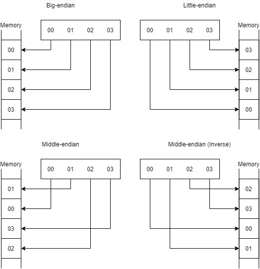

# Data Types

RuneScape uses a number of uncommon and bespoke data formats to obsfuscate communication and reduce cache file size.

Each client revision randomises the [endianness](#endianness) and [modifications](#modifications) used for decoding client packets. The OSRS protocol scrambling follows a decipherable order (citation needed).

## Standard Java Data Types
RuneScape client uses [Java's primitive data types](https://docs.oracle.com/javase/tutorial/java/nutsandbolts/datatypes.html) to store and transmit information, understanding these limitations and sizes are important regardless of client revision.

| Type | Size | Minimum Value | Maximum Value |
|---|---|---|---|
| byte | 1 byte | -128 | 127 |
| short | 2 bytes | -32,768 | 32,767 |
| int | 4 bytes | -2,147,483,648 | 2,147,483,647 |
| long | 8 bytes | -9,223,372,036,854,775,808 | 9,223,372,036,854,775,807 |
| float | 4 bytes |  |  |
| double | 8 bytes |  |  |
| boolean | 1 bit | false | true |
| char | 2 bytes | 0 | 65535 |

> 2,147,483,647 is the maximum stack a player can have of one item because item amounts are stored as integers.

### Signed and unsigned

Data types typically are Signed, easily thought of as a single bit assigned as a binary flag denoting a positive or negative number. However when only positive values are necessary the flag can be unsigned allowing a larger number to be stored in the same amount of space.

| Type | Size | Minimum Unsigned Value | Maximum Unsigned Value |
|---|---|---|---|
| byte | 1 byte | 0 | 255 |
| short | 2 bytes | 0 | 65,535 |
| int | 4 bytes | 0 | ‭4,294,967,296‬ |
| long | 8 bytes | 0 | ‭18,446,744,073,709,551,616‬ |

> Methods utilising unsigned integers commonly use 'U' as a prefix e.g. `readUByte`

### Bit Access

The client also utilises reading and writing individual bits interchangeably with other data types.

> TODO code example needed for both read and write which cleanly breaks down how it works

## Obfuscation methods

### Endianness

The read and write order of byte data is called Endianness
RuneScape client occasionally uses a middle-endian (integer's only) the order of which is determined by an [inverse modification](#modifications).



* Big - Most significant bit first
* Little - Least significant bit first
* Middle - Most significant bit central

### Modifications

Several further modifications can be made to bytes before and reversed afterwards as obfuscation

| Name | Read | Write |
|---|---|---|
| A | `value - 128` | `value + 128` |
| C | `-value` | `-value` |
| S | `128 - value` | `128 - value` |

### Implementation

[Kotlin](ModifiedEndianIO.kts) (bespoke type support needed)

## Bespoke types

### Medium/Tribyte

A custom data type for storing 3 byte numbers between -8,388,608 and 8,388,607

## Smart
Functions that "smartly" choose the smallest data type necessary to store the value provided

e.g
```text
if value < byte max
  write byte
else
  write short
```
